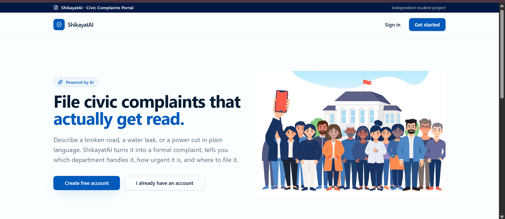
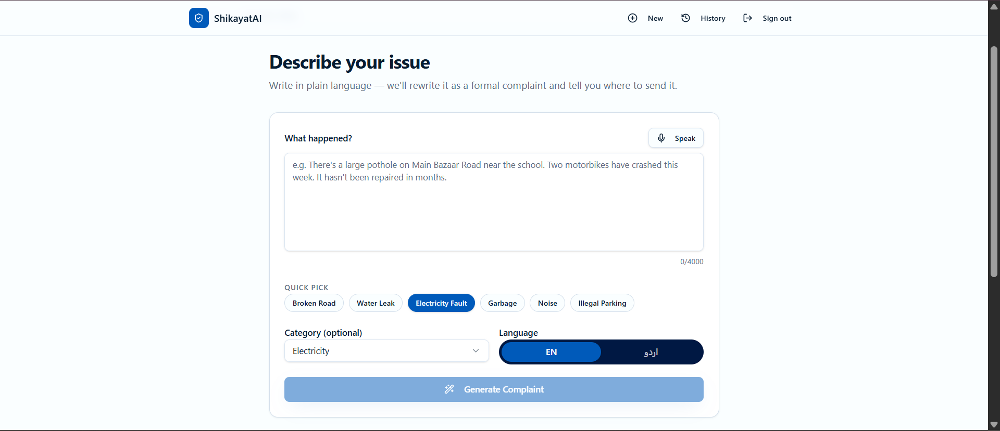
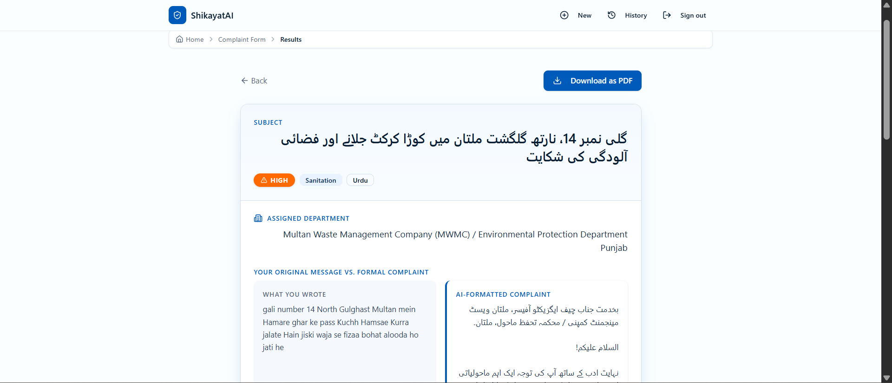
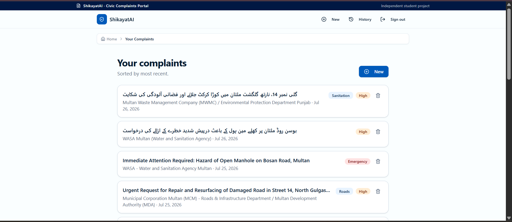
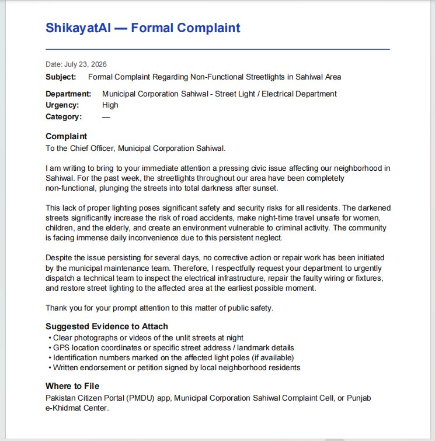

ShikayatAI — Civic Complaint Assistant 

ShikayatAI ("shikayat" means "complaint" in Urdu) helps everyday citizens in Pakistan turn informal, plain-language descriptions of civic problems — broken roads, water leakage, electricity faults, garbage, noise, illegal parking — into professional, formally worded complaints, addressed to the correct government department, with guidance on urgency, evidence to attach, and where to file. 

The problem it solves 

Most citizens who face civic issues either don't complain at all, or write informal, emotional messages that get ignored by overworked municipal offices because they lack the structure, tone, and specificity that formal grievance systems expect. ShikayatAI removes that barrier: a user describes their issue in their own words — in English, Urdu, or even by voice — and the app instantly produces a properly formatted complaint ready to submit, along with practical next steps (which department, how urgent, what evidence to bring, where to file). It's built for everyday residents of Pakistan, especially those less comfortable writing formal English or Urdu themselves. 

 

Live App 

🔗 Live URL (primary): https://shikayatai.lovable.app  

🔗 Live URL (mirror): https://shikayatai.vercel.app   

Both links run the same app and UI. The Lovable link is the primary/reference deployment, using a Supabase Edge Function that calls the Google Gemini API directly with the system prompt documented below. Vercel mirror uses Lovable's AI gateway for complaint generation, with a formatted fallback template if the AI call fails, to ensure the app never breaks for the end user 

 

Features 

Account system — simple email/password sign-up and sign-in, powered by Supabase Auth 

Plain-language complaint input — a large text box for describing an issue in natural language, no formal writing skills required 

Voice input — a microphone button using the browser's built-in Web Speech API to dictate a complaint instead of typing, supporting both English and Urdu speech recognition 

Quick-select issue chips — one-tap buttons (Broken Road, Water Leak, Electricity Fault, Garbage, Noise, Illegal Parking) that auto-fill the category 

Category selector — optional manual dropdown (Water, Electricity, Roads, Sanitation, Police, Other) if auto-detection isn't wanted 

Language toggle — switch between English and Urdu; the AI-generated complaint is produced in the selected language 

AI-generated formal complaint — one click transforms the raw description into a structured, professionally worded complaint 

Results page showing:  

A formal subject line 

The full rewritten formal complaint text 

The assigned government department/authority 

An urgency level badge (Low / Medium / High / Emergency) 

A checklist of suggested evidence to attach (photos, GPS location, documents, etc.) 

Where this type of complaint is typically filed, with an embedded map when the location can be geocoded 

A side-by-side view comparing the user's original message with the AI-formatted version 

Download as PDF — generates a formatted PDF of the complaint (subject, body, department, urgency, evidence, filing location, and the date) using jsPDF 

Complaint history dashboard — logged-in users can view all their previously generated complaints, sorted by most recent 

Delete complaints — users can remove any past complaint from their history at any time 

Clean, official-style design — blue-and-white color scheme, header identification bar, breadcrumb navigation, and a footer with privacy/about information, styled to feel trustworthy like a government portal 

 

The AI Feature 

What it does: When a user submits their issue description (plus optional category and language), the app calls the Google Gemini API through a Supabase Edge Function (generate-complaint). Gemini analyzes the raw text and returns a structured JSON response containing a formal subject line, a fully rewritten formal complaint in the correct register and language, the responsible department, an urgency assessment, suggested evidence, and where the complaint is typically filed. 

System prompt used (from the generate-complaint Supabase Edge Function, called directly on the primary/Lovable deployment): 

You are an assistant that converts informal civic complaints into professional formal complaints  
suitable for submission to government departments in Pakistan / South Asia. Return ONLY valid JSON  
matching this schema: 
{ 
 "subject": "Formal, concise subject line (max 15 words). If the requested language is Urdu, write  
   this in Urdu script (Nasta'līq); otherwise write it in English.", 
 "formal_complaint": "Full formal complaint body written in polite, professional tone in the  
   requested language. Include salutation, clear description of the issue, its impact, and a  
   specific request for action. 150-300 words.", 
 "department": "Specific responsible department name in English (e.g. 'WASA - Water and Sanitation  
   Agency', 'K-Electric', 'Municipal Corporation Roads Department')", 
 "urgency": "One of exactly these English values only: Low, Medium, High, Emergency. Never translate  
   this field. Never add parentheses or extra text.", 
 "suggested_evidence": ["List of 3-5 specific pieces of evidence the user should attach, in English  
  (photos, videos, receipts, etc.)"], 
 "filing_location": "Where this type of complaint is typically filed, in English. Include portals,  
   hotlines, offices (e.g. 'Pakistan Citizen Portal (pmdu.gov.pk), local Union Council office, or  
   department helpline 1334')." 
} 
Only the 'subject' and 'formal_complaint' fields should be translated to the requested language (Urdu  
script when Urdu is requested). All other fields — department, urgency, suggested_evidence, and  
filing_location — must remain in English. The urgency field must always be one of: Low, Medium, High,  
Emergency exactly. 
 

Model used: Google Gemini (via direct API call from the Supabase Edge Function, on the primary Lovable deployment) / Lovable AI gateway with template fallback (on the Vercel mirror) 

 

Tools, Services & AI Models Used 

Lovable — AI app builder used to design and build the frontend, backend logic, and Supabase integration 

Supabase — authentication, Postgres database (storing users' complaint history), and Edge Functions (serverless backend for the AI call) 

Google Gemini API — the AI model that generates the formal complaint content 

Web Speech API (browser built-in) — voice-to-text input, no external service or key required 

jsPDF — client-side PDF generation for the "Download as PDF" feature 

OpenStreetMap Nominatim — free geocoding of the filing location to show an embedded map, where available 

Google Stitch — used during the design phase to prototype an alternative visual concept; several ideas (quick-select chips, urgency badges, evidence checklist, side-by-side comparison view) were adapted from this prototype into the final Lovable build 

GitHub — public code repository 

Vercel — secondary hosting/deployment 

Google AI Studio — used to generate the Gemini API key 

 

Screenshots 

  

  

  

  

 
 

How to Run This Project Locally 

Prerequisites: Node.js (or Bun, since this project uses bun.lock), and a Supabase project of your own if you want the AI feature to work locally. 

Clone the repository 

git clone https://github.com/rehma1ajmal1-debug/shikayatai.git 
cd shikayatai 
 

Install dependencies 

bun install 
# or, if you prefer npm: 
npm install 
 

Set up environment variables 

Create a .env file in the project root with: 

VITE_SUPABASE_URL=your-supabase-project-url 
VITE_SUPABASE_PUBLISHABLE_KEY=your-supabase-publishable-key 
VITE_SUPABASE_PROJECT_ID=your-supabase-project-id 
SUPABASE_URL=your-supabase-project-url 
SUPABASE_PUBLISHABLE_KEY=your-supabase-publishable-key 
SUPABASE_PROJECT_ID=your-supabase-project-id 
 

These are safe, public-facing Supabase values. The Gemini API key is not set here — it lives as a Supabase Edge Function secret (GEMINI_API_KEY), configured in your Supabase project dashboard under Edge Functions → Secrets, and is never exposed in the codebase or frontend. 

Run the development server 

bun run dev 
# or: npm run dev 
 

Open the local URL shown in your terminal (typically http://localhost:5173 or similar). 

Note: complaint generation requires a working Supabase project with the generate-complaint Edge Function deployed and a valid GEMINI_API_KEY secret configured — without this, the AI feature will not work, but the rest of the UI can still be explored. 
